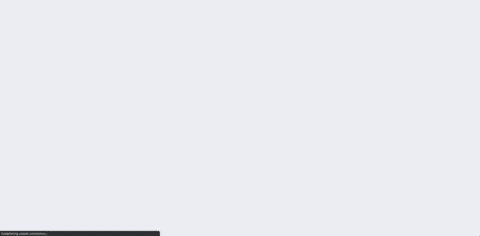
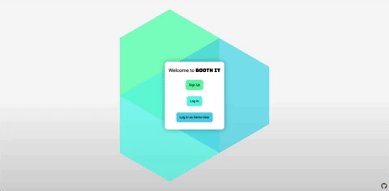
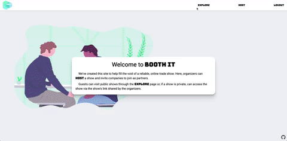
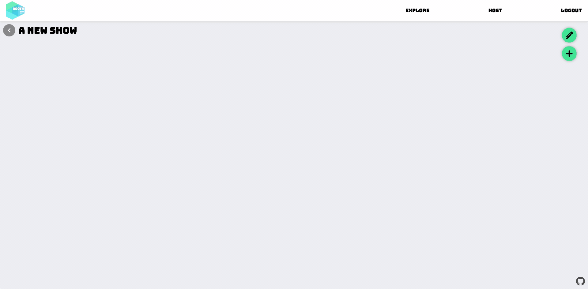
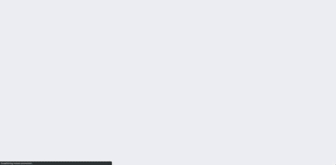
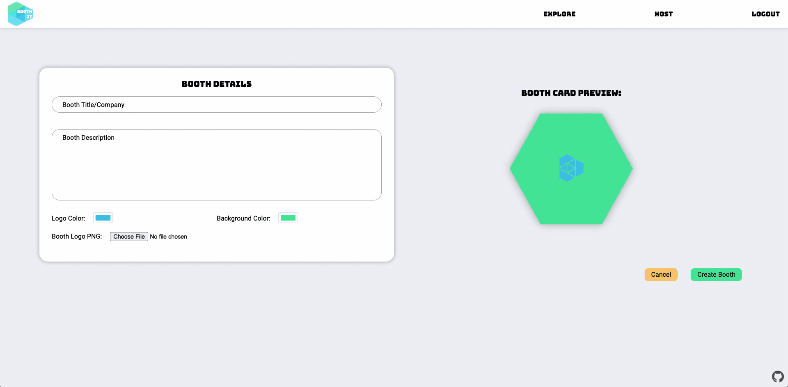
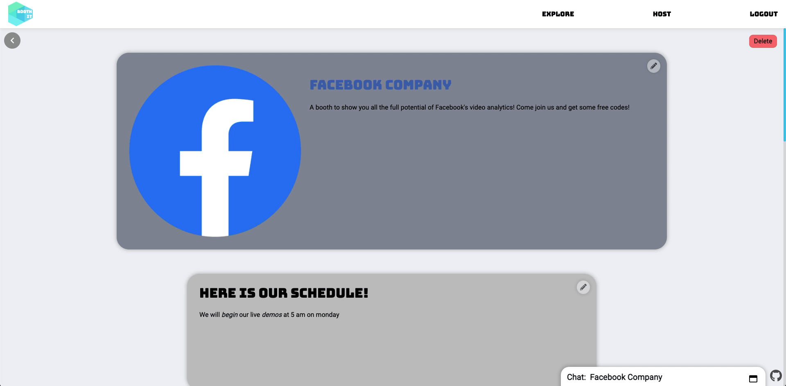
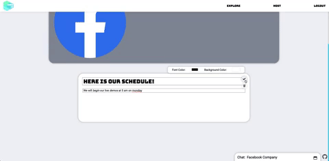
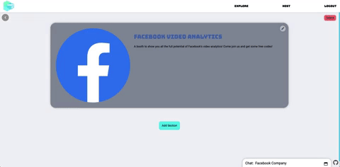

# Booth It


<br>

**Booth It** is a webapp for hosting conference and trade show events online with a heavy focus on individual customization for an individual's space.

## Demo

Check out a live demo here: [https://booth-it.herokuapp.com](https://booth-it.herokuapp.com)

## Built With

<h5>Font End</h5>
<a href="#"></a>
<a href="https://sass-lang.com/"></a>
<a href="https://reactjs.org/"></a>
<a href="https://redux.js.org/"></a>
<a href="https://https://reactrouter.com//"></a>
<h5>Back End</h5>
<a href="https://flask.palletsprojects.com/en/1.1.x/"></a>
<a href="https://www.postgresql.org/"></a>
<h5>Deployment and Package Management</h5>
<a href="https://heroku.com/"></a>
<a href="https://docker.com/"></a>
<a href="#"></a>
<a href="https://www.npmjs.com/"></a>

<a href="https://github.com/sjstark/booth-it/wiki/External-Technologies">External Technologies</a>

## Site

### Splash Screen



### User Authentication

#### Login



#### Signup


### Application

#### Show and Booth Navigation

Shows and Booths are displayed in a hexagonal grid to prevent a "hierarchy" from developing in listings.



#### Host a Show

Users are able to host shows for specific dates.


#### Invite Partners for a Show

Dynamic server generated links allow for private invite links to be sent to partners.



#### Invite Acceptance

Invite links inform players what show they are accepting a link to and who they're logged in as.



#### Create a Booth

Partners are able to create a booth in a similar manner to show creation.



### Booth Profile

#### Booth Messenger

Attendees are able to "visit" a booth and chat with the booth's employees. Allowing for real time discussions of booth materials.



#### Profile Customization

Partners are able to customize sections on their booth profile, adding content such as text, video, and images. Additional brand customization is available in the form of color.






## Usage

### Development

Want to contribute?

To fix a bug or add a feature, follow these steps:

- Fork the repository
- Create a new branch with `git checkout -b feature-branch-name`
- Make appropriate changes to the files and push back to github
- Create a Pull Request
   - Use a clear and descriptive title for the issue to identify the suggestion.
   - Include any relevant issue numbers in the PR body, not the title.
   - Provide a comprehensive description of all changes made.

#### Setting Up and Starting a Local Server

1. Clone this repository (only this branch)

   ```bash
   git clone https://github.com/sjstark/booth-it.git
   ```

2. Install dependencies

      ```bash
      pipenv install --dev -r dev-requirements.txt && pipenv install -r requirements.txt
      ```

3. Create a **.env** file based on the example with proper settings for your
   development environment
4. Setup your PostgreSQL user, password and database and make sure it matches your **.env** file

5. Get into your pipenv, migrate your database, seed your database, and run your flask app

   ```bash
   pipenv shell
   ```

   ```bash
   flask db upgrade
   ```

   ```bash
   flask seed all
   ```

   ```bash
   flask run
   ```

6. To run the React App in development, in a separate terminal:

   ```
   cd client
   ```

   ```
   npm install
   ```

   ```
   npm start
   ```

***
*IMPORTANT!*
   If you add any python dependencies to your pipfiles, you'll need to regenerate your requirements.txt before deployment.
   You can do this by running:

   ```bash
   pipenv lock -r > requirements.txt
   ```

*ALSO IMPORTANT!*
   psycopg2-binary MUST remain a dev dependency because you can't install it on apline-linux.
   There is a layer in the Dockerfile that will install psycopg2 (not binary) for us.
***

### Deployment to Heroku

1. Create a new project on Heroku
2. Under Resources click "Find more add-ons" and add the add on called "Heroku Postgres"
3. Install the [Heroku CLI](https://devcenter.heroku.com/articles/heroku-command-line)
4. Run

   ```bash
   heroku login
   ```

5. Login to the heroku container registry

   ```bash
   heroku container:login
   ```

6. Update the `REACT_APP_BASE_URL` variable in the Dockerfile.
   This should be the full URL of your Heroku app: i.e. "https://flask-react-aa.herokuapp.com"
7. Push your docker container to heroku from the root directory of your project.
   This will build the dockerfile and push the image to your heroku container registry

   ```bash
   heroku container:push web -a {NAME_OF_HEROKU_APP}
   ```

8. Release your docker container to heroku

   ```bash
   heroku container:release web -a {NAME_OF_HEROKU_APP}
   ```

9. set up your database:

   ```bash
   heroku run -a {NAME_OF_HEROKU_APP} flask db upgrade
   heroku run -a {NAME_OF_HEROKU_APP} flask seed all
   ```

10. Under Settings find "Config Vars" and add any additional/secret .env variables.


### Bug / Feature Request

We love squashing bugs! If you find one, let our exterminators know by opening an issue [here](https://github.com/sjstark/booth-it/issues). Be sure to be clear in the description of the bug (i.e. what was input into the field that caused the bug). Screenshots or recordings greatly help!

If you'd like to request a new feature open up an issue [here](https://github.com/sjstark/booth-it/issues). This project was created as part of [App Academy's](https://www.appacademy.io/) coursework, but we love dreaming up of ways to improve our work.


## Built By

[Sam Stark](https://github.com/sjstark)
